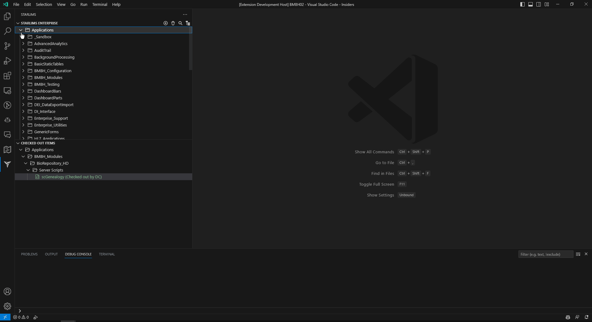

# STARLIMS VS Code

Extension provides Visual Studio Code integration with STARLIMS Enterprise Designer. Started as a fun project to brush up on Typescript and learn the Visual Studio Code extensibility API.

## Disclaimer

This is an unofficial, unsupported, extension so use at your own risk.



# Authors

- [Marius Popovici](https://github.com/mariuspopovici)
- [Christoph Döllinger](https://github.com/MrDoe/)
- [Jan Bouecke](https://github.com/jbouecke/)

## Pre-requisites

- Download STARLIMS .sdp package attached to [current release](https://github.com/mariuspopovici/starlimsvscode/releases).
- Import .sdp package into STARLIMS Designer. Subsequent versions will be updated automatically.
  - If you are deploying on a product development environment (System Layer ID 200) please make sure to select the "Overwrite System Layer" option during the package import
- Add the following setting to STARLIMS web.config file

```
<add key="HTTPServices" value="SCM_API.*"/>
```

## Vision

- Implement a Git-like mechanism for managing versions.
- Design HTML forms directly in VS Code via a HTML preview window.
- Implement more features from Starlims Designer

## Features

Features:

- Explore Enterprise Designer (Applications, Data Sources, Server Scripts and Client Scripts)
- Check out STARLIMS code items to a local folder
- Edit local copies and compare changes with remote version
- Check in changes to the server
- Open forms in browser (Chrome or Edge) and debug them in VS Code
- Execute remote scripts and view execution return values
- Execute data sources and render data source execution results in a grid view
- View and clear user logs
- Launch XFD forms via the STARLIMS bridge
- Syntax color theme and highlighting for SSL and SSL SQL data sources
- Global, full text search in scripts / code with code item type selection
- Search code items by name
- Explore tables and view table schema

To Do:

- Create a HTML form designer
- Implement table support including a schema and ERD generator / viewer

## Extension Settings

This extension contributes the following settings:

- `STARLIMS.url`: URL to Starlims installation (e. g. http://starlimsdev/STARLIMS11.STARLIMS.DEV/)
- `STARLIMS.user`: User for STARLIMS authentication
- `STARLIMS.password`: User password STARLIMS authentication
- `STARLIMS.browser`: Browser for debugging forms (only Chrome or Edge supported)
- `STARLIMS.rootPath`: Path for storing temporary files (downloaded forms and scripts)

## How to Use

- Install the latest version of the extension from the [Visual Studio Marketplace](https://marketplace.visualstudio.com/items?itemName=MariusPopovici.vscode-starlims&ssr=false#qna)
- Download the extension files attached to the [current release](https://github.com/mariuspopovici/starlimsvscode/releases) and import the SCM_API.sdp package into STARLIMS
- Add a local folder to the current VS Code workspace. This will serve as your local STARLIMS code repository.
- Activate the extension clicking the STARLIMS logo in the VS Code sidebar.
- Configure the extension settings (STARLIMS url, user and password, root folder). You will be prompted to set these upon attempting to activate the extension for the first time. The root folder should be set as the path to the folder selected in the previous step.
- Configure the VS Code Color Theme and activate the **SSL Language Theme (Dark)** theme.

## Known Issues

- Please let us know under "Issues"

## Release Notes

### 1.0.0

Initial release of STARLIMS VS Code

## 1.1.0

Resurrected this project. Updated dependencies including the new VS Code API.
Replaced request-promise with node-fetch.
Implemented a TextDocumentContentProvider for viewing STARLIMS code and refactored API to implement a URI based approach for referencing code items.

## 1.1.1

- Bug fixes
- Added Get Local Version to remote version editor window context menu
- Activation of extension when executing a compare command
- Showing remote checkout status in explorer tree

## 1.2.x

New features:

- Automatically export items to local workspace
- Check in/out items
- View/clear user logs
- Add/delete new items and categories
- Search for items
- Run HTML forms in browser
- Run XFD form (requires STARLIMS Bridge)
- Integrated SSL-Lang theme
- Debug HTML forms directly in VS Code
- Run data sources and server scripts
- Support for exploring database and dictionary tables, view table definition and tree commands for generating INSERT, DELETE, SELECT and UPDATE statements for the selected table.
- Go to script/form under the cursor
- View checked out items, check in pending, undo check out, view checked out items from all uses, refresh checked out items tree
- Global search / full text search in code items
- View and edit form resources
- Rename items and categories
- Move items
- Misc. bug fixes
